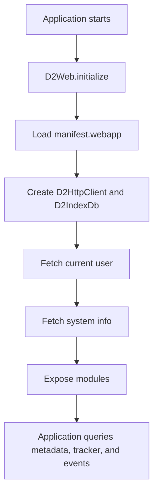

# Architecture and runtime

The SDK has four main layers.

## 1. Runtime singleton

`D2Web` is the application runtime. It owns:

- configuration
- the shared `D2HttpClient`
- app manifest
- current user
- system info
- module factories

```ts
const d2 = await D2Web.initialize({});
```

## 2. Metadata query layer

Modules such as `programModule`, `dataElementModule`, `optionSetModule`, and `userModule.user` build URLs using a generic `BaseQuery`.

This is the fluent API that supports:

- `select(...)`
- `where(...)`
- `byId(...)`
- `with(...)`
- `paginate(...)`
- `get()`

## 3. Tracker and event data layer

`trackerModule` and `eventModule` use dedicated query builders rather than the generic metadata query API.

These builders support DHIS2 tracker/event patterns such as:

- org unit scoping
- program and stage selection
- tracker/event filters
- date filters
- pagination
- ordering
- draft creation
- save via tracker import endpoint

## 4. Shared model and utility layer

Shared classes provide:

- `Pager`
- `DataQueryFilter`
- `DataOrderCriteria`
- `D2Response`
- `D2HttpClient`
- `D2IndexDb`
- decorators and constants

## Runtime attachment to `window`

The runtime is attached to:

```ts
(window as any).d2Web
```

This matters because tracker and event metadata helpers internally read `window.d2Web`.

## Lifecycle summary



## When to use which API

Use **metadata query builders** when you need metadata relations and field selection.

Use **tracker/event query builders** when you need to work with tracked entities, enrollments, or events.

Use **httpInstance** when:

- the SDK does not expose a setter or query capability yet
- you need an unsupported endpoint
- you want full control over the request URL
- you want IndexedDB-backed GET requests
